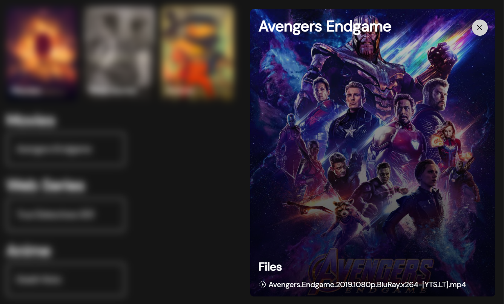

# home-server

- Want to watch your favourite tv shows on your mobile/ipad/tv, but too lazy to copy them?
- It is a multimedia home server, which streams your media to your favorite device

## screenshots

<p align='center'>
    
    
</p>

## run on your machine

- Node 14.x should be installed

### set up your media database

- In the project directory, create a folder named `database`, and then in it, create individual folders, for one movie/web series, and follow naming convention like this, **Avengers Endgame MOVIE\*** or for web series, do it like **True Detectives WEB SERIES**, or for your anime, do it like **Death Note ANIME**, and then in the folder, place yoiur media files.

### fire up the server

- Go to the base project directory and run
  ```
      npm run start
  ```
- Go to the ./client directory and run

  ```
      npm start
  ```

- Now your project should be live on `localhost:3000/`

* **NOTE:** Because browsers did not support .mkv files to play, therefore, it can play .mp4, .avi, .webm video extensions etc.
